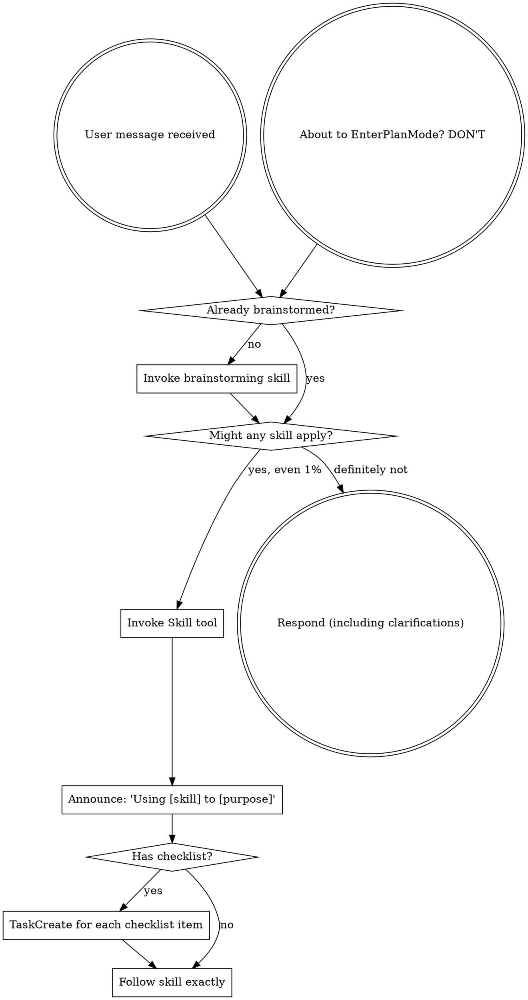

# Model Selection and Workflow Fixes Implementation Plan

> **For agentic workers:** REQUIRED SUB-SKILL: Use superpowers-extended-cc:subagent-driven-development to implement this plan task-by-task. Steps use checkbox (`- [ ]`) syntax for tracking.

**Goal:** Add flexible 3-tier model selection (haiku/sonnet/opus) to all skills that dispatch subagents, fix the brainstorm re-trigger loop, auto-proceed through the full workflow pipeline, and incorporate upstream hook changes.

**Architecture:** Create a shared model selection guide referenced by all skills. Edit workflow skills to remove user gates and the mid-conversation re-trigger. Replace the finishing-a-development-branch options menu with deterministic push+PR behavior.

**Tech Stack:** Markdown skill files, bash hooks, JSON config

---

### Task 1: Create Model Selection Guide

**Goal:** Create the shared reference document that all skills will reference for model selection.

**Files:**
- Create: `skills/shared/model-selection-guide.md`

**Acceptance Criteria:**
- [ ] File exists at `skills/shared/model-selection-guide.md`
- [ ] Contains the 3-tier table (Light/Standard/Heavy)
- [ ] Contains the hard constraint banning claude-sonnet-4-5
- [ ] Contains per-skill application guidance
- [ ] Defines "Explore-type agents" explicitly

**Verify:** `cat skills/shared/model-selection-guide.md | head -5` -> should show the title and description

**Steps:**

- [ ] **Step 1: Create the model selection guide**

Create `skills/shared/model-selection-guide.md` with this content:

```markdown
# Model Selection Guide

Shared reference for choosing which model to use when dispatching subagents. All skills that dispatch subagents MUST consult this guide.

## 3-Tier Scale

Match the model to the cognitive demand of the **specific subagent dispatch**, not the overall project. A complex project still uses haiku for exploration and sonnet for implementation.

| Tier | Model | Cognitive Profile | Examples |
|------|-------|-------------------|----------|
| **Light** | `model: "haiku"` | Read-only, pattern matching, simple transforms | Codebase exploration, file searches, formatting, gathering context, running commands and reporting output |
| **Standard** | `model: "sonnet"` | Write code, follow specs, targeted reasoning | Implementation, writing tests, making edits, standard debugging, writing docs |
| **Heavy** | `model: "opus"` | Judge, argue, reconcile, architect | Adversarial review, architectural decisions, complex multi-file reasoning, reconciliation, final quality gates |

## Hard Constraint

`claude-sonnet-4-5` is **banned**. The `"sonnet"` alias must resolve to `claude-sonnet-4-6`. The only permitted models are:

- `claude-opus-4-6` (Heavy tier)
- `claude-sonnet-4-6` (Standard tier)
- `claude-haiku-4-5` (Light tier)

Always pass the `model` parameter explicitly when dispatching subagents. Never omit it.

## Per-Skill Application

| Skill | Subagent Role | Tier |
|-------|---------------|------|
| **brainstorming** | Adversarial review (advocate/challenger) | Heavy (opus) |
| **writing-plans** | Adversarial review (advocate/challenger) | Heavy (opus) |
| **subagent-driven-development** | Implementer | Standard (sonnet) |
| **subagent-driven-development** | Spec compliance reviewer | Heavy (opus) |
| **subagent-driven-development** | Code quality reviewer | Heavy (opus) |
| **subagent-driven-development** | Final code reviewer | Heavy (opus) |
| **dispatching-parallel-agents** | Depends on task | Match tier to what agent does |
| **systematic-debugging** | Hypothesis testing / exploration | Light (haiku) |
| **systematic-debugging** | Fix implementation | Standard (sonnet) |
| **requesting-code-review** | Code reviewer | Heavy (opus) |
| **writing-skills** | Testing subagents | Standard (sonnet) |

**Explore-type agents** - any subagent dispatched with `subagent_type: "Explore"`, or whose sole purpose is reading files, searching code, or gathering context without making edits - always use **Light (haiku)**.
```

- [ ] **Step 2: Commit**

```bash
git add skills/shared/model-selection-guide.md
git commit -m "feat: NO_JIRA add shared model selection guide for subagent dispatch"
```

---

### Task 2: Remove Mid-Conversation Brainstorm Re-trigger

**Goal:** Eliminate the brainstorm loop by removing the mid-conversation re-trigger logic from using-superpowers.

**Files:**
- Modify: `skills/using-superpowers/SKILL.md`

**Acceptance Criteria:**
- [ ] The "Mid-Conversation Re-trigger" section is completely removed
- [ ] A replacement rule states brainstorming runs once at session start only
- [ ] Three Red Flags table entries are removed ("We already brainstormed this session", "This is a follow-up", "The user said 'also'")
- [ ] Process flow diagram no longer has the "New non-trivial ask?" path

**Verify:** `grep -c "Mid-Conversation Re-trigger" skills/using-superpowers/SKILL.md` -> should return 0

**Steps:**

- [ ] **Step 1: Remove the Mid-Conversation Re-trigger section**

In `skills/using-superpowers/SKILL.md`, find and delete the entire section from `## Mid-Conversation Re-trigger` through the end of the "Default: trigger" paragraph (everything before the dot graph). Replace with:

```markdown
## Brainstorming Scope

Brainstorming runs once at session start for the initial ask. It does not re-trigger automatically mid-conversation. If the user wants to brainstorm a new idea during an active session, they invoke it explicitly with `/superpowers-extended-cc:brainstorming`.
```

- [ ] **Step 2: Update the process flow diagram**

Replace the entire `digraph skill_flow` block with:



- [ ] **Step 3: Remove re-trigger Red Flags entries**

In the Red Flags table, remove these three rows:

```
| "We already brainstormed this session" | Each new ask gets its own evaluation. Session does not equal scope. |
| "This is a follow-up" | Follow-ups to the same task are fine. New features are not follow-ups. |
| "The user said 'also'" | "Also" usually means new scope. Evaluate before skipping. |
```

- [ ] **Step 4: Commit**

```bash
git add skills/using-superpowers/SKILL.md
git commit -m "fix: NO_JIRA remove mid-conversation brainstorm re-trigger to prevent loops"
```

---

### Task 3: Auto-Proceed from Brainstorming to Writing-Plans

**Goal:** Remove the user review gate after adversarial spec review so brainstorming flows directly into writing-plans.

**Files:**
- Modify: `skills/brainstorming/SKILL.md`

**Acceptance Criteria:**
- [ ] Checklist step 9 ("User reviews spec") is removed
- [ ] Former step 10 ("Transition to implementation") is renumbered to 9
- [ ] The "User Review Gate" section (the block quote asking user to review) is removed
- [ ] After adversarial review, the skill immediately invokes writing-plans
- [ ] Model guide reference is added for adversarial review subagents
- [ ] Process flow diagram no longer has "User reviews spec?" diamond

**Verify:** `grep -c "User reviews spec" skills/brainstorming/SKILL.md` -> should return 0

**Steps:**

- [ ] **Step 1: Remove checklist step 9 and renumber**

In the checklist section, remove:

```markdown
9. **User reviews written spec** - ask user to review the spec file before proceeding
   - TaskCreate subject: `"User reviews spec"`
```

And change step 10 to step 9:

```markdown
9. **Transition to implementation** - invoke writing-plans skill to create implementation plan
    - TaskCreate subject: `"Transition to implementation"`
```

- [ ] **Step 2: Remove User Review Gate section**

Find and delete the entire "User Review Gate" block:

```markdown
**User Review Gate:**
After the spec review loop passes, ask the user to review the written spec before proceeding:

> "Spec written and committed to `<path>`. Please review it and let me know if you want to make any changes before we start writing out the implementation plan."

Wait for the user's response. If they request changes, make them and re-run the spec review loop. Only proceed once the user approves.
```

Replace with:

```markdown
**Auto-proceed:** After adversarial review fixes are applied, immediately invoke the writing-plans skill. Do not pause for user review.
```

- [ ] **Step 3: Update process flow diagram**

In the `digraph brainstorming` block, remove the "User reviews spec?" diamond and its edges. Change the flow so "Adversarial spec review" connects directly to "Invoke writing-plans skill":

Replace:
```
    "Adversarial spec review\n(advocate + challenger)" -> "User reviews spec?";
    "User reviews spec?" -> "Write design doc" [label="changes requested"];
    "User reviews spec?" -> "Invoke writing-plans skill" [label="approved"];
```

With:
```
    "Adversarial spec review\n(advocate + challenger)" -> "Invoke writing-plans skill";
```

And remove the "User reviews spec?" node declaration.

- [ ] **Step 4: Add model guide reference to adversarial review**

In the adversarial spec review section, after "Both subagents MUST use model: opus.", add:

```markdown
See `skills/shared/model-selection-guide.md` for the full model selection policy.
```

- [ ] **Step 5: Commit**

```bash
git add skills/brainstorming/SKILL.md
git commit -m "feat: NO_JIRA auto-proceed from spec to writing-plans, add model guide reference"
```

---

### Task 4: Tighten Writing-Plans Auto-Proceed

**Goal:** Ensure writing-plans auto-invokes subagent-driven-development with no competing instructions, and add model guide reference.

**Files:**
- Modify: `skills/writing-plans/SKILL.md`

**Acceptance Criteria:**
- [ ] No "ask the user", "present options", or "wait for" language exists that could override the HARD-GATE
- [ ] Model guide reference is added for adversarial review subagents
- [ ] The Execution Handoff HARD-GATE remains intact

**Verify:** `grep -c "No user choice" skills/writing-plans/SKILL.md` -> should return 1

**Steps:**

- [ ] **Step 1: Add model guide reference to adversarial plan review**

In the adversarial plan review section, after "Both subagents MUST use model: opus.", add:

```markdown
See `skills/shared/model-selection-guide.md` for the full model selection policy.
```

- [ ] **Step 2: Verify no competing instructions**

Search the file for any language that could cause the agent to pause before subagent-driven-development invocation. Look for: "ask", "wait", "confirm", "present options", "which option", "user choice". If any are found outside the HARD-GATE context, remove or rewrite them.

- [ ] **Step 3: Commit**

```bash
git add skills/writing-plans/SKILL.md
git commit -m "feat: NO_JIRA add model guide reference to writing-plans"
```

---

### Task 5: Update Subagent-Driven-Development Model Policy

**Goal:** Replace the hardcoded model policy with a reference to the shared guide while keeping the role/rationale table.

**Files:**
- Modify: `skills/subagent-driven-development/SKILL.md`

**Acceptance Criteria:**
- [ ] Model Policy section references the shared guide
- [ ] The role/rationale table is preserved but updated to reference tiers
- [ ] No hardcoded model values remain outside the table

**Verify:** `grep -c "model-selection-guide" skills/subagent-driven-development/SKILL.md` -> should return 1

**Steps:**

- [ ] **Step 1: Update the Model Policy section**

Replace the current Model Policy section:

```markdown
## Model Policy

Implementation subagents use sonnet. Review and orchestration use opus. The orchestrator (you) stays on opus to catch what sonnet misses.

| Role | Model | Rationale |
|------|-------|-----------|
| Implementation subagents | `model: "sonnet"` | Mechanical work from well-specified plans |
| Spec compliance reviewer subagents | `model: "opus"` | Judgment-heavy, catches spec drift |
| Code quality reviewer subagents | `model: "opus"` | Judgment-heavy, catches quality issues |
| Final code reviewer subagent | `model: "opus"` | Holistic review across all tasks |
```

With:

```markdown
## Model Policy

See `skills/shared/model-selection-guide.md` for the full 3-tier model selection policy. The orchestrator (you) stays on opus to catch what lower tiers miss.

| Role | Tier | Model | Rationale |
|------|------|-------|-----------|
| Implementation subagents | Standard | `model: "sonnet"` | Write code from well-specified plans |
| Spec compliance reviewer subagents | Heavy | `model: "opus"` | Judgment-heavy, catches spec drift |
| Code quality reviewer subagents | Heavy | `model: "opus"` | Judgment-heavy, catches quality issues |
| Final code reviewer subagent | Heavy | `model: "opus"` | Holistic review across all tasks |
```

- [ ] **Step 2: Commit**

```bash
git add skills/subagent-driven-development/SKILL.md
git commit -m "feat: NO_JIRA reference shared model selection guide in subagent-driven-development"
```

---

### Task 6: Auto-Finish with Push and PR

**Goal:** Replace the 4-option menu in finishing-a-development-branch with deterministic push+PR behavior.

**Files:**
- Modify: `skills/finishing-a-development-branch/SKILL.md`

**Acceptance Criteria:**
- [ ] Step 3 no longer presents a 4-option menu
- [ ] Deterministic behavior: verify tests -> rebase -> push -> create PR -> report URL -> cleanup
- [ ] Test failure is the only gate (stop and report)
- [ ] Scope note clarifies this applies only when invoked by the workflow pipeline
- [ ] Quick Reference table is updated
- [ ] Common Mistakes and Red Flags sections are updated

**Verify:** `grep -c "Which option" skills/finishing-a-development-branch/SKILL.md` -> should return 0

**Steps:**

- [ ] **Step 1: Update the description frontmatter**

Replace:
```yaml
description: Use when implementation is complete, all tests pass, and you need to decide how to integrate the work - guides completion of development work by presenting structured options for merge, PR, or cleanup
```

With:
```yaml
description: Use when implementation is complete and all tests pass - pushes branch and creates PR against base branch automatically
```

- [ ] **Step 2: Update the Overview section**

Replace:
```markdown
**Core principle:** Verify tests -> Present options -> Execute choice -> Clean up.
```

With:
```markdown
**Core principle:** Verify tests -> Rebase -> Push -> Create PR -> Clean up.
```

- [ ] **Step 3: Replace Step 3 (Present Options) and Step 4 (Execute Choice)**

Replace everything from `### Step 3: Present Options` through the end of `#### Option 4: Discard` with:

```markdown
### Step 3: Push and Create PR

```bash
# Push branch
git push -u origin <feature-branch>

# Create PR
gh pr create --title "<title>" --body "$(cat <<'EOF'
## Summary
<2-3 bullets of what changed>

## Test Plan
- [ ] <verification steps>
EOF
)"
```

Report the PR URL to the user.

**Scope:** This auto-finish behavior applies when `finishing-a-development-branch` is invoked by the workflow pipeline (after subagent-driven-development or executing-plans completes). It does not affect manual branch management outside the skill system.
```

- [ ] **Step 4: Update Step 5 (Cleanup Worktree)**

Replace the cleanup section to remove option references:

```markdown
### Step 4: Cleanup Worktree

**Delete lockfile (if exists):**
```bash
rm -f "$worktree_path/.claude-instance-lock"
```

**Delete checkpoint state (if exists):**
```bash
rm -f .claude-workflow-state.json
```

Check if in worktree:
```bash
git worktree list | grep $(git branch --show-current)
```

If yes:
```bash
git worktree remove <worktree-path>
```
```

- [ ] **Step 5: Update Quick Reference table**

Replace the existing quick reference with:

```markdown
## Quick Reference

| Step | Action |
|------|--------|
| 1. Verify tests | Run test suite, stop if failing |
| 2. Rebase check | Fetch origin, rebase if behind, re-run tests |
| 3. Push + PR | Push branch, create PR, report URL |
| 4. Cleanup | Remove lockfile, checkpoint, worktree |
```

- [ ] **Step 6: Update Common Mistakes and Red Flags**

Replace the Common Mistakes section with:

```markdown
## Common Mistakes

**Skipping test verification**
- **Problem:** Push broken code, create failing PR
- **Fix:** Always verify tests before pushing

**Force-pushing without request**
- **Problem:** Rewrite shared history
- **Fix:** Only force-push when user explicitly asks
```

Replace the Red Flags section with:

```markdown
## Red Flags

**Never:**
- Push with failing tests
- Force-push without explicit request
- Delete work without confirmation
- Skip rebase check

**Always:**
- Verify tests before pushing
- Rebase onto latest base branch
- Create PR with descriptive title and summary
- Clean up worktree after PR creation
```

Update the "Always" list at the bottom of Red Flags to remove references to 4 options.

- [ ] **Step 7: Commit**

```bash
git add skills/finishing-a-development-branch/SKILL.md
git commit -m "feat: NO_JIRA replace options menu with deterministic push+PR in finishing-a-development-branch"
```

---

### Task 7: Add Model Guide References to Remaining Skills

**Goal:** Add model selection guide references to skills that dispatch subagents but currently don't specify models.

**Files:**
- Modify: `skills/dispatching-parallel-agents/SKILL.md`
- Modify: `skills/systematic-debugging/SKILL.md`
- Modify: `skills/requesting-code-review/SKILL.md`
- Modify: `skills/writing-skills/SKILL.md`
- Modify: `skills/executing-plans/SKILL.md`

**Acceptance Criteria:**
- [ ] All 5 files reference `skills/shared/model-selection-guide.md`
- [ ] References are placed in contextually appropriate locations
- [ ] executing-plans references updated finishing-a-development-branch behavior

**Verify:** `grep -rl "model-selection-guide" skills/` -> should list all 5 files plus the 3 already modified

**Steps:**

- [ ] **Step 1: Add model guide to dispatching-parallel-agents**

In `skills/dispatching-parallel-agents/SKILL.md`, after the "### 3. Dispatch in Parallel" heading, add before the code block:

```markdown
**Model selection:** See `skills/shared/model-selection-guide.md`. Match the model tier to what each parallel agent is doing (Light for exploration, Standard for implementation, Heavy for review).
```

- [ ] **Step 2: Add model guide to systematic-debugging**

In `skills/systematic-debugging/SKILL.md`, in the "Related skills" section at the bottom, add:

```markdown
- **`skills/shared/model-selection-guide.md`** - When dispatching subagents for hypothesis testing (Light tier) or fix implementation (Standard tier)
```

- [ ] **Step 3: Add model guide to requesting-code-review**

In `skills/requesting-code-review/SKILL.md`, after the "## How to Request" heading, add:

```markdown
**Model selection:** Code reviewer subagents use Heavy tier (opus). See `skills/shared/model-selection-guide.md`.
```

- [ ] **Step 4: Add model guide to writing-skills**

In `skills/writing-skills/SKILL.md`, in the "RED-GREEN-REFACTOR for Skills" section under "### RED: Write Failing Test (Baseline)", add after "Run pressure scenario with subagent WITHOUT the skill":

```markdown
**Model selection:** Testing subagents use Standard tier (sonnet). See `skills/shared/model-selection-guide.md`.
```

- [ ] **Step 5: Add model guide to executing-plans and update stale reference**

In `skills/executing-plans/SKILL.md`, add a model selection reference in the appropriate location:

```markdown
**Model selection:** See `skills/shared/model-selection-guide.md` for model tier guidance when dispatching subagents.
```

Also verify that any reference to finishing-a-development-branch behavior matches the new deterministic push+PR flow (no mention of "present options" or "execute choice").

- [ ] **Step 6: Commit**

```bash
git add skills/dispatching-parallel-agents/SKILL.md skills/systematic-debugging/SKILL.md skills/requesting-code-review/SKILL.md skills/writing-skills/SKILL.md skills/executing-plans/SKILL.md
git commit -m "feat: NO_JIRA add model selection guide references to remaining skills"
```

---

### Task 8: Apply Upstream Hook Changes and Update README

**Goal:** Incorporate upstream commit c78dfe33 changes: make pre-commit hook opt-in, narrow blocking to in_progress tasks only, update README.

**Files:**
- Delete: `hooks/pre-commit-check-tasks`
- Modify: `hooks/examples/pre-commit-check-tasks.sh`
- Modify: `hooks/hooks.json`
- Modify: `README.md`

**Acceptance Criteria:**
- [ ] `hooks/pre-commit-check-tasks` no longer exists
- [ ] `hooks/examples/pre-commit-check-tasks.sh` blocks only on `in_progress` tasks
- [ ] `hooks/hooks.json` has no PreToolUse entry
- [ ] README describes the hook as optional with opt-in instructions
- [ ] README is updated to reflect all workflow changes (model selection, no re-trigger, auto-proceed, auto-finish)

**Verify:** `test ! -f hooks/pre-commit-check-tasks && echo "deleted"` -> should print "deleted"

**Steps:**

- [ ] **Step 1: Delete the pre-commit-check-tasks executable**

```bash
git rm hooks/pre-commit-check-tasks
```

- [ ] **Step 2: Update hooks/examples/pre-commit-check-tasks.sh**

Replace the comment block at the top:

```bash
#!/usr/bin/env bash
# PreToolUse hook: block git commit when native tasks are in progress.
# Add this to your project's .claude/settings.local.json (see README).
#
# How it works:
# - Triggers on Bash tool calls containing "git commit"
# - Parses the session transcript for TaskCreate/TaskUpdate calls
# - Blocks only when tasks have "in_progress" status
# - Pending tasks pass through, enabling per-task commit workflows
```

Replace the Python status check from:
```python
print(sum(1 for s in tasks.values() if s not in ('completed', 'cancelled', 'deleted')))
```

To:
```python
print(sum(1 for s in tasks.values() if s == 'in_progress'))
```

Replace the error message from:
```bash
    echo "COMMIT BLOCKED: $OPEN_TASKS incomplete native task(s). Finish tasks before committing." >&2
```

To:
```bash
    echo "COMMIT BLOCKED: $OPEN_TASKS native task(s) still in progress. Finish the current task before committing." >&2
```

- [ ] **Step 3: Update hooks/hooks.json**

Replace the entire file content with (this is the cleanest approach since the file is small):

```json
{
  "hooks": {
    "SessionStart": [
      {
        "matcher": "startup|clear|compact",
        "hooks": [
          {
            "type": "command",
            "command": "\"${CLAUDE_PLUGIN_ROOT}/hooks/run-hook.cmd\" session-start",
            "async": false
          }
        ]
      }
    ]
  }
}
```

- [ ] **Step 4: Update README.md**

In the "What This Fork Changes" table, update these rows:

Replace the "Brainstorming re-trigger" row:
```
| Brainstorming scope | `using-superpowers` | Brainstorming runs once at session start. No automatic mid-conversation re-trigger. Users invoke explicitly if needed. |
```

Replace the "Opus-only subagents" row:
```
| 3-tier model selection | `subagent-driven-development`, all skills | Shared model guide: haiku for exploration, sonnet for implementation, opus for review. See `skills/shared/model-selection-guide.md`. |
```

Add a new row:
```
| Auto-finish | `finishing-a-development-branch` | Automatically pushes branch and creates PR. No options menu. Only gate is test failure. |
```

In "The Workflow" section, update step 6:
```
6. **finishing-a-development-branch** - Mandatory before any push or PR. Verifies tests, rebases, pushes branch, creates PR automatically. Cleans up worktree.
```

Remove the sentence at the end: "Non-trivial mid-conversation asks re-trigger brainstorming."

In the "Block Commits With Incomplete Tasks" section, update the heading and description:

```markdown
### Optional: Block Commits With In-Progress Tasks

When using native tasks, you can optionally block commits while tasks are still in progress. This plugin includes an example hook for this. Pending tasks pass through, enabling per-task commit workflows (e.g., subagent-driven-development can commit after each task).
```

- [ ] **Step 5: Commit**

```bash
git add -A hooks/ README.md
git commit -m "feat: NO_JIRA incorporate upstream hook changes (opt-in pre-commit), update README"
```
